  

 

  <a href="https://kineticsolutions.com.br" target="_blank">
    
    &nbsp;<b>KSI - Kinetic Solutions</b>
  </a>
  &nbsp;&nbsp;&nbsp;&nbsp; | &nbsp;&nbsp;&nbsp;&nbsp;
  <a href="https://aultimapassageira.com.br" target="_blank">
    
    &nbsp;<b>A Última Passageira</b>
  </a>
  &nbsp;&nbsp;&nbsp;&nbsp; | &nbsp;&nbsp;&nbsp;&nbsp;
  <a href="https://www.linkedin.com/in/saymonflima/" target="_blank">
    
    &nbsp;<b>LinkedIn</b>
  </a>

 

<h2 align="center">📊 Activity & Performance</h2>

  

 

<table align="center" width="100%" border="0" cellpadding="0" cellspacing="0">
  <tr>
    <td width="50%" align="center">
      
    </td>
  </tr>
</table>

 

<h2 align="center">🏗️ Ecosystem & Projects</h2>

 

<table align="center" width="100%" border="0" cellpadding="15" cellspacing="0">
  <tr>
    <td width="50%" valign="top">
      <h3>
         
        <a href="https://gourmetech.netlify.app/">Gourmetech</a>
      </h3>
      
ERP e PDV inteligente para gestão ágil de food services, comércio e restaurantes.

        
    </td>
    <td width="50%" valign="top">
      <h3>
         
        <a href="https://app-kadem.netlify.app/">Kadem</a>
      </h3>
      
Plataforma de produtividade e gestão de tarefas construída com arquitetura Offline First.

        
    </td>
  </tr>
  <tr>
    <td width="50%" valign="top">
      <h3>
         
        <a href="https://agendaspro.netlify.app/">AgendasPRO</a>
      </h3>
      
Plataforma SaaS completa para gestão de tempo, serviços e autoagendamento inteligente.

        
    </td>
    <td width="50%" valign="top">
      <h3>
         
        <a href="https://kapturextension.netlify.app/">Kaptur</a>
      </h3>
      
Extensão ágil para gravação, edição e publicação de tela direto no seu navegador.

       
    </td>
  </tr>
</table>

 

  

 

<h2 align="center">⚙️ Core Stack</h2>

  

 

  

